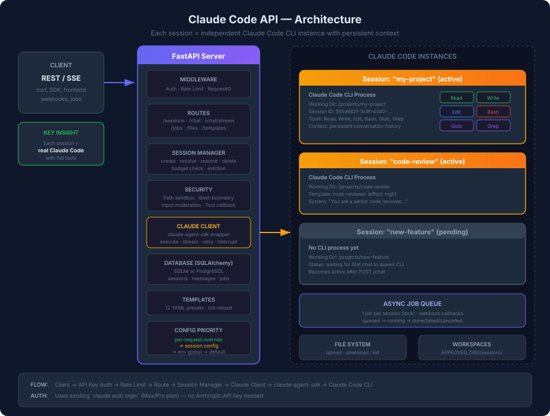

<p align="center">
  <h1 align="center">Claude Code API</h1>
  <p align="center">
    REST API wrapper for Claude Code CLI — execute code, manage files, and run commands remotely.
  </p>
  <p align="center">
    <a href="https://github.com/arktnld/claude-code-api/releases"></a>
    <a href="LICENSE"></a>
    <a href="https://www.python.org/"></a>
    <a href="https://fastapi.tiangolo.com/"></a>
    <a href="https://github.com/arktnld/claude-code-api/stargazers"></a>
    <a href="https://github.com/arktnld/claude-code-api/issues"></a>
    <a href="https://github.com/arktnld/claude-code-api/wiki"></a>
  </p>
</p>

<p align="center">
  <a href="#features">Features</a> •
  <a href="#quick-start">Quick Start</a> •
  <a href="#api-overview">API Overview</a> •
  <a href="https://github.com/arktnld/claude-code-api/wiki">Wiki</a> •
  <a href="docs/">Docs</a> •
  <a href="#configuration">Configuration</a> •
  <a href="#docker">Docker</a>
</p>

---

## About

**Claude Code API** exposes Claude Code's full capabilities through a REST API. Built on [`claude-agent-sdk`](https://github.com/anthropics/claude-code-sdk-python), it spawns the real Claude Code CLI with access to all native tools — Read, Write, Edit, Bash, Glob, Grep, and more.

> [!IMPORTANT]
> This is an **educational/study project**. It is not affiliated with or endorsed by Anthropic. Use at your own risk. See [Disclaimer](#disclaimer).

### Why this project?

If you already have **Claude Code CLI** installed and logged in on your machine (`claude auth login`), this API turns it into a **remote-accessible service** — no Anthropic API key needed, no extra billing. Your existing **Max or Pro plan** powers every request.

| | Traditional API | Claude Code API |
|---|---|---|
| **Authentication** | Requires `ANTHROPIC_API_KEY` | Works with your existing CLI login |
| **Billing** | Pay per API token | Uses your Max/Pro plan — already paid |
| **Tools** | Text-only LLM responses | Full tool access: Read, Write, Edit, Bash, Glob, Grep |
| **Capabilities** | Chat completion | Executes real code, creates files, runs commands |
| **Context** | Stateless | Persistent sessions with auto-resume |
| **Setup** | Get API key, configure SDK | `claude auth login` → done |

> **TL;DR:** Already paying for Claude Max? This gives you a REST API on top of it — for free.

## Features

| Feature | Description |
|---------|-------------|
| **Full Claude Code access** | All CLI tools: Read, Write, Edit, Bash, Glob, Grep, LS, MultiEdit |
| **Session management** | Named sessions with auto-resume, templates, and lifecycle tracking |
| **Sync & Stream chat** | Synchronous responses or real-time SSE streaming |
| **Async jobs** | Fire-and-forget with webhook callbacks and cancellation |
| **File management** | Upload, download, and list files in session workspaces |
| **Agent templates** | 12 pre-configured profiles (code-reviewer, debug, devops, etc.) — customizable via YAML |
| **Security** | API key auth, rate limiting, path sandboxing, input moderation, budget caps |
| **RFC 9457 errors** | Structured Problem Details on every error response |
| **Swagger UI** | Interactive docs at `/docs` with categorized endpoints |
| **Usage & audit** | Cost tracking, usage stats, and full audit trail |
| **Docker ready** | Production Dockerfile with gunicorn + uvicorn workers |

## Quick Start

### Prerequisites

- Python 3.11+
- [Claude Code CLI](https://docs.anthropic.com/en/docs/claude-code) installed and logged in (`claude auth login`)

### Install

```bash
git clone https://github.com/arktnld/claude-code-api.git
cd claude-code-api

python -m venv .venv
source .venv/bin/activate
pip install -e ".[dev]"
```

### Configure

```bash
cp .env.example .env
```

Edit `.env`:
```env
APPROVED_DIRECTORY=/home/user/projects
API_KEYS=my-secret-key
```

### Run

```bash
make dev
```

Server at `http://localhost:8000`. Docs at [`http://localhost:8000/docs`](http://localhost:8000/docs).

## API Overview

### Create a session

```bash
curl -s -X POST http://localhost:8000/api/v1/sessions \
  -H "X-API-Key: my-secret-key" \
  -H "Content-Type: application/json" \
  -d '{"name": "my-project"}' | python -m json.tool
```

### Chat with Claude

```bash
curl -s -X POST http://localhost:8000/api/v1/sessions/my-project/chat \
  -H "X-API-Key: my-secret-key" \
  -H "Content-Type: application/json" \
  -d '{"message": "create a hello.py that prints Hello World"}' | python -m json.tool
```

```json
{
  "data": {
    "session_id": "555a982f-...",
    "content": "I've created hello.py with a Hello World print statement.",
    "cost": 0.003,
    "duration_ms": 4521,
    "num_turns": 2,
    "tools_used": [
      {"name": "Write", "input": {"file_path": "hello.py", "content": "print('Hello World')"}}
    ]
  },
  "meta": {"request_id": "abc123", "timestamp": "...", "version": "v1"}
}
```

### Stream responses (SSE)

```bash
curl -N -X POST http://localhost:8000/api/v1/sessions/my-project/chat/stream \
  -H "X-API-Key: my-secret-key" \
  -H "Content-Type: application/json" \
  -d '{"message": "read hello.py"}'
```

### Use a template

```bash
curl -s -X POST http://localhost:8000/api/v1/sessions \
  -H "X-API-Key: my-secret-key" \
  -H "Content-Type: application/json" \
  -d '{"name": "review-auth", "template": "code-reviewer"}' | python -m json.tool
```

> See the full [API Reference](docs/api-reference.md) for all endpoints.

## All Routes

```
Health
  GET    /api/v1/health                              Health check (no auth)

Sessions
  POST   /api/v1/sessions                            Create session
  GET    /api/v1/sessions                            List sessions (paginated)
  GET    /api/v1/sessions/{name}                     Get session
  DELETE /api/v1/sessions/{name}                     Delete session
  POST   /api/v1/sessions/{name}/repo                Change working directory

Chat
  POST   /api/v1/sessions/{name}/chat                Chat (sync)
  POST   /api/v1/sessions/{name}/chat/stream         Chat (SSE stream)

History
  GET    /api/v1/sessions/{name}/history              Chat history

Jobs
  POST   /api/v1/sessions/{name}/jobs                Create async job (202)
  GET    /api/v1/sessions/{name}/jobs                List jobs
  GET    /api/v1/sessions/{name}/jobs/{id}           Get job status
  POST   /api/v1/sessions/{name}/jobs/{id}/cancel    Cancel job

Files
  POST   /api/v1/sessions/{name}/files               Upload file
  GET    /api/v1/sessions/{name}/files               List files
  GET    /api/v1/sessions/{name}/files/{path}        Download file

Templates
  GET    /api/v1/templates                            List templates
  GET    /api/v1/templates/{name}                     Get template
  POST   /api/v1/templates/reload                     Hot-reload from YAML

Utilities
  POST   /api/v1/tokens/count                        Estimate token count
  GET    /api/v1/usage                               Usage statistics
  GET    /api/v1/audit                               Audit trail
```

## Configuration

All settings via environment variables or `.env` file. See [Configuration docs](docs/configuration.md) for full reference.

| Variable | Default | Description |
|----------|---------|-------------|
| `API_KEYS` | *(empty = no auth)* | Comma-separated API keys |
| `APPROVED_DIRECTORY` | `.` | Root directory for sessions |
| `CLAUDE_MODEL` | *(CLI default)* | Model override |
| `CLAUDE_MAX_TURNS` | `25` | Max turns per request |
| `CLAUDE_TIMEOUT_SECONDS` | `300` | Request timeout |
| `SANDBOX_ENABLED` | `true` | OS-level bash sandboxing |
| `RATE_LIMIT_REQUESTS` | `30` | Requests per window |
| `CLAUDE_MAX_COST_PER_USER` | `50.0` | Max USD per user |

> Full list: [docs/configuration.md](docs/configuration.md)

## Docker

```bash
docker compose up --build -d
```

Or manually:
```bash
docker build -t claude-code-api .
docker run -p 8000:8000 --env-file .env -v /your/projects:/projects claude-code-api
```

## Architecture

<p align="center">
  
</p>

```
src/
├── main.py              # FastAPI app, lifespan, error handlers (RFC 9457)
├── config.py            # Settings from env
├── api/
│   ├── routes.py        # Core endpoints + response envelopes
│   ├── jobs.py          # Async job execution + webhooks
│   ├── files.py         # File upload/download/list
│   ├── extras.py        # Usage, templates, audit, moderation, tokens
│   ├── deps.py          # Dependency injection
│   └── middleware.py     # Request ID, body limit, security headers
├── claude/
│   ├── client.py        # claude-agent-sdk wrapper (execute, stream, retry)
│   └── exceptions.py    # Error hierarchy
├── sessions/
│   └── manager.py       # Session lifecycle, budget, auto-resume
├── security/
│   ├── auth.py          # API key auth, rate limiter
│   └── validators.py    # Path traversal, bash boundary checks
└── storage/
    └── database.py      # SQLite async (sessions, messages, jobs)
```

## Documentation

> Full documentation available on the [Wiki](https://github.com/arktnld/claude-code-api/wiki) and in the [docs/](docs/) folder.

| Document | Description |
|----------|-------------|
| [Getting Started](docs/getting-started.md) | Installation, first session, first chat |
| [Authentication](docs/authentication.md) | API keys, Claude auth modes |
| [Sessions](docs/sessions.md) | CRUD, lifecycle, templates, working directories |
| [Chat](docs/chat.md) | Sync, streaming, SSE format, idempotency |
| [Jobs](docs/jobs.md) | Async execution, webhooks, cancellation |
| [Files](docs/files.md) | Upload, download, list |
| [Configuration](docs/configuration.md) | All environment variables |
| [Security](docs/security.md) | Auth, rate limiting, sandboxing, moderation |
| [Error Handling](docs/error-handling.md) | RFC 9457, status codes, examples |
| [API Reference](docs/api-reference.md) | Complete route table with request/response |

## Development

```bash
make dev        # Hot-reload server
make prod       # Production (gunicorn)
make docker     # Docker compose
make test       # Run tests
make lint       # Check code
make format     # Auto-format
```

## Contributing

Contributions are welcome! Please open an issue first to discuss what you'd like to change.

## Disclaimer

> [!CAUTION]
> This project is an **educational study** and proof of concept. It is **not affiliated with, endorsed by, or officially supported by Anthropic**.
>
> - This wraps Claude Code CLI via `claude-agent-sdk` — usage is subject to [Anthropic's Terms of Service](https://www.anthropic.com/terms)
> - **Do not** expose this API to the public internet without proper security measures
> - The authors are not responsible for any misuse, costs incurred, or damages
> - This is provided "as-is" for learning purposes — **use in production at your own risk**

## License

[MIT](LICENSE) — see [LICENSE](LICENSE) for details.
